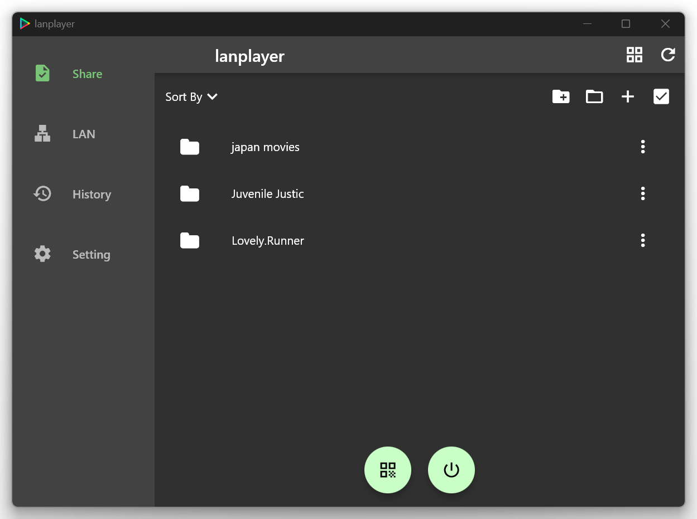
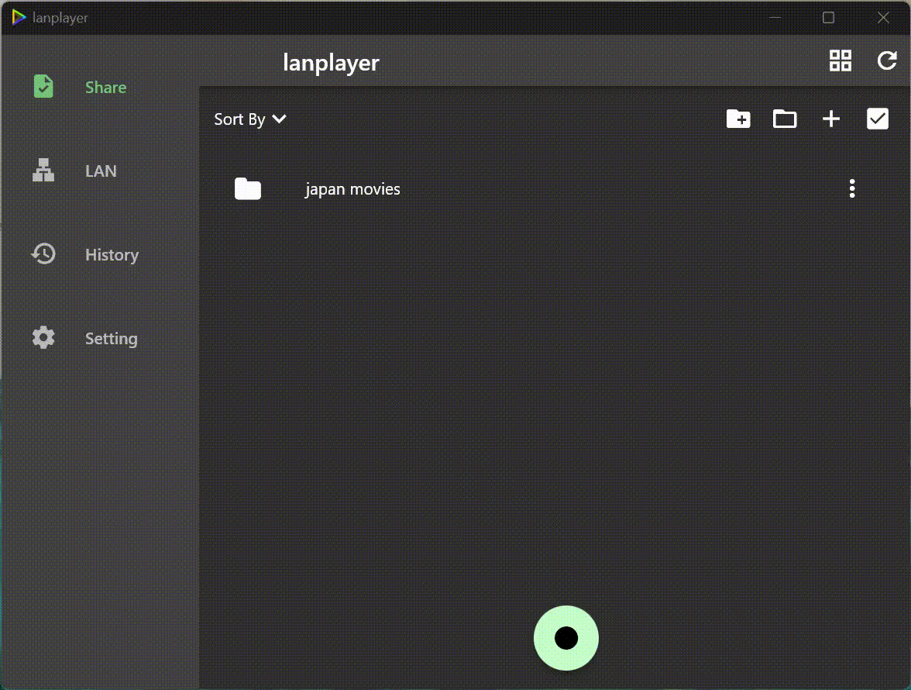

 

  

  <h1 align="center">✨ Watch video in LAN ✨</h1>

  

   LanPlayer is a powerful software designed for seamless video sharing and playback across local area networks (LAN).🚀 It supports almost all popular video formats on almost all devices.
     
     
    <a href="https://lanplayer.app/">Homepage</a>
    .
    <a href="https://github.com/freedomlight2015/lanplayer/issues">Report Bug</a>
    .
    <a href="https://github.com/freedomlight2015/lanplayer/issues">Request Feature</a>
  

 

## Table Of Contents

- [Features](#-features)
- [Download](#-download)
- [Getting Started](#-getting-started)
- [Demo video](#demo-video)
  - [Add video & start share](#add-video-start-share)
  - [Watch on web browser](#watch-on-web-browser)
  - [Watch on app](#watch-on-app)
- [Questions](#-questions)
- [Acknowledgements](#-acknowledgements)
- [License](#-license)

## ⚡Features

- **Suppport almost all device** Easily share and play videos/movies within the local network (LAN) using Lanplayer , it supports almost all devices and all video formats.
- **Support web browser:** Watch on webbrowser without install software.
- **Easy to use:** Easy management with bulk video import and deletion.
- **Support PlayList & history:** Supports playback history, automatically resumes from the last played position.
- **Privicy support:** With the Access Pwssword, you can keep your video files safe.
- **High quality:** Play 1080p and 4K video without no reduction in output quality.

## Download

<table>
    <thead>
        <tr>
            <th>Platform</th>
            <th>Package Type</th>
            <th>Download Link</th>
        </tr>
    </thead>
    <tbody>
        <tr>
            <td rowspan=2>Windows</td>
            <td><code>EXE Installer</code></td>
            <td><a href="">Link</a></td>
        </tr>
        <tr>
            <td><code>Portable ZIP</code></td>
            <td><a href="">Link</a></td>
        </tr>
        <tr>
            <td>MacOS</td>
            <td><code>DMG Installer</code></td>          
            <td><a href="">Link</a></td>
        </tr>
        <tr>
            <td rowspan=3>Linux</td>
            <td><code>Flathub</code></td>
            <td><a href="">Link</a></td>
        </tr>
        <tr>
            <td><code>SNAP</code></td>
            <td><a href="">Link</a></td>
        </tr>
        <tr>
            <td><code>DEB</code></td>
            <td><a href="">Link</a></td>
        </tr>
        <tr>
            <td>Android</td>
            <td><code>APK</code></td>
            <td><a href="">Link</a></td>
        </tr>
        <tr>
            <td>iOS</td>
            <td><code>IPA</code></td>
            <td><a href="">Link</a></td>
        </tr>
    </tbody>
</table>

## 🤓 Getting Started

- 1. Click [this link](https://lanplayer.app) download the software.
- 2. Add the videos you want to watch to Lanplayer. You can either directly import a folder or select multiple videos to add.
- 3. Click the "Start sharing Video" button.
- 4. Watch video, you can access the video from other device,like phone or computer, click [this link](https://lanplayer.app) see the demo video.
- For more details [see the app homepage](https://lanplayer.app)

> Hint: we can watch the sharing video on web browser,but only supports playing common video formats like MP4 etc, if other format, you can download the app to watch them.

## 🚀 Demo video

### Add video and start share

### Watch on app

### Watch on webbrowser

## 🤲🏻 Questions

***Do I need to install the software on all devices?***

- Only the device sharing the videos needs to install the software. Other devices can watch via their built-in browser without any installation.

***Why can’t the browser support all video formats?***
- The HTML5 standard supports only common media formats and codecs. MP4 is the most widely supported format by browsers, and most videos today are in this format.

***Is it free to use?***
- You can try it for free for 7 days. After that, a purchase is required, but don’t worry, the price is very affordable, and future updates are provided for free.

## 😎 Acknowledgements

Big thanks to authors of these libraries:

- https://github.com/Blazity/next-saas-starter - generate my website
- https://github.com/GopeedLab/gopeed - thank the ui design,it's my horrible thing design the ui

## 📝 License

Distributed under the MIT License. See [LICENSE](https://github.com/Blazity/next-saas-starter/blob/main/LICENSE.md) for more information.
